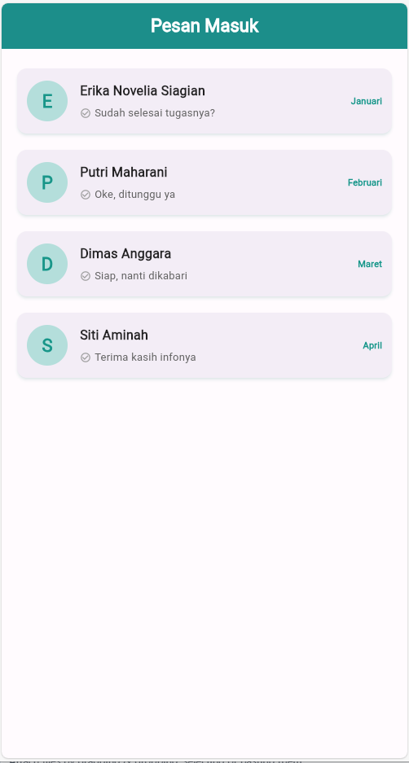
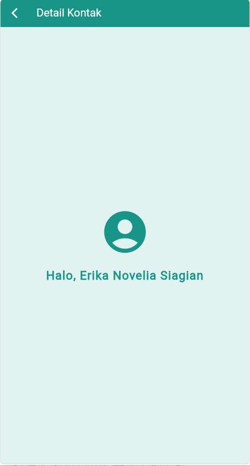

# UAS Pemrograman Mobile - Aplikasi Chat & Navigasi

Proyek ini disusun sebagai pemenuhan Tugas Ujian Akhir Semester (UAS) mata kuliah Pemrograman Mobile. Aplikasi ini dibangun menggunakan **Flutter** dengan fitur utama menampilkan daftar pesan dan navigasi antar halaman.

## 👤 Identitas Mahasiswa

| Informasi | Detail |
| :--- | :--- |
| **Nama** | **Erika Novelia Siagian** |
| **NIM** | 213303030471 |
| **Kelas** | PAGI C |
| **Prodi** | Teknik Informatika |

## 📱 Screenshot Output

Berikut adalah hasil tampilan aplikasi:

| Halaman Utama (List Chat) | Halaman Detail (Sapaan) |
| :---: | :---: |
|  |  |

> *Catatan: Klik gambar untuk memperbesar (jika diperlukan).*

## 🚀 Fitur Utama

* **ListView Builder**: Menampilkan data list secara dinamis.
* **Navigation & Routing**: Menggunakan `Navigator.push` dan `Navigator.pop`.
* **Passing Data**: Mengirim data `String` (Nama) antar widget.
* **Custom UI**: Menggunakan tema warna **Teal**, `CircleAvatar`, dan `Card` dengan shadow.

## 🛠️ Cara Menjalankan Project

Ikuti langkah-langkah berikut untuk menjalankan proyek ini di mesin lokal Anda:

1.  **Clone Repository**
    ```bash
    git clone [https://github.com/username-kamu/nama-repo-kamu.git](https://github.com/username-kamu/nama-repo-kamu.git)
    ```

2.  **Masuk ke Folder Project**
    ```bash
    cd nama-repo-kamu
    ```

3.  **Install Dependencies**
    ```bash
    flutter pub get
    ```

4.  **Jalankan Aplikasi**
    ```bash
    flutter run
    ```

---
**Dibuat dengan ❤️ menggunakan Flutter**
